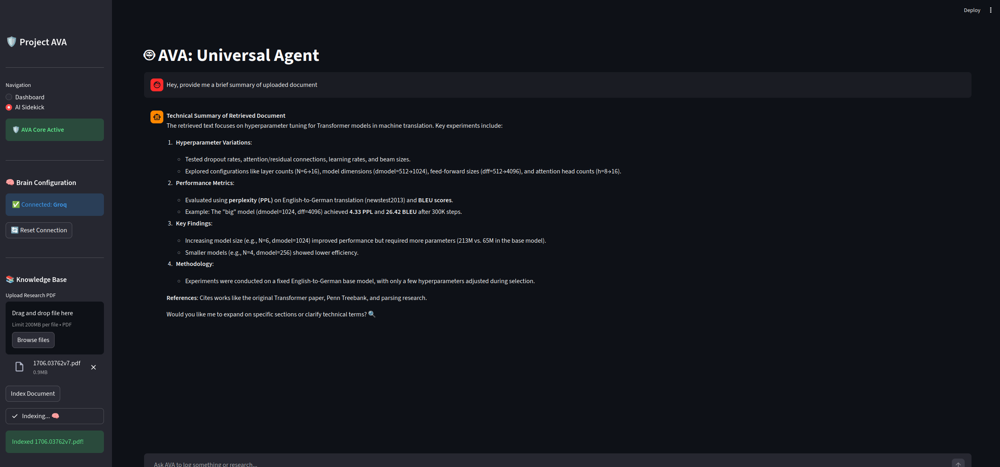
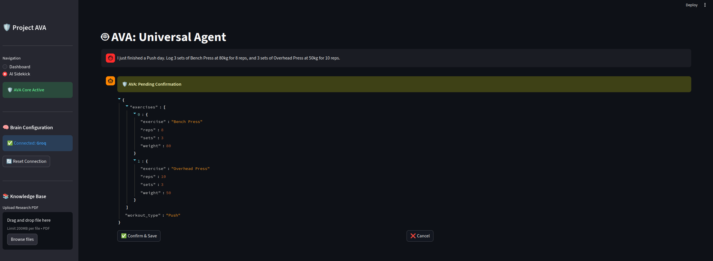
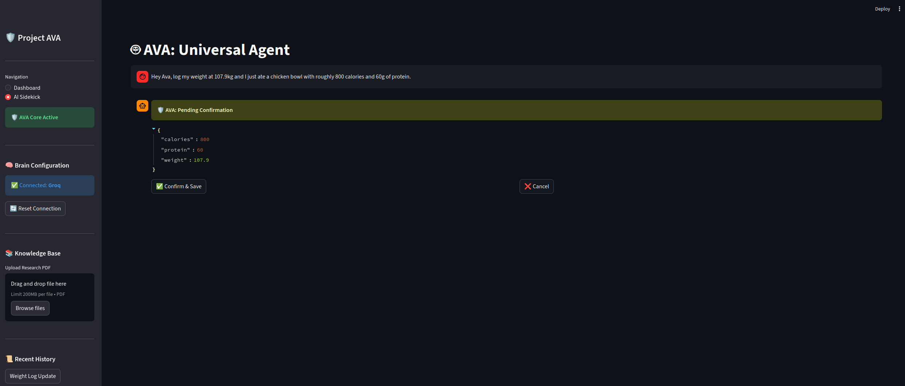
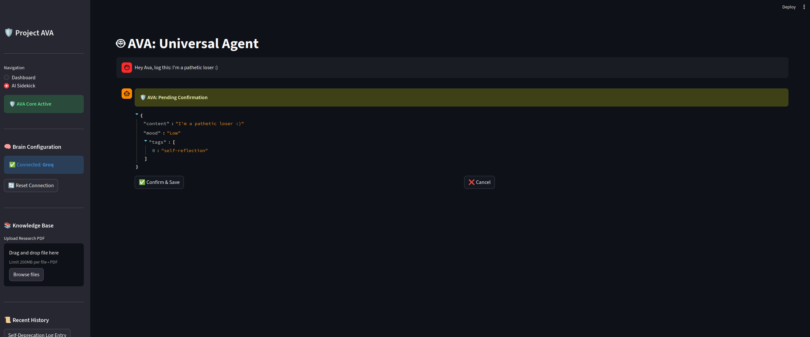

# Project AVA
**Advanced Virtual Assistant: Version 1.0.0**

Project AVA is a production-grade personal intelligence ecosystem designed to centralize life management through artificial intelligence. It integrates high-precision fitness tracking, cognitive journaling, and RAG-based (Retrieval-Augmented Generation) research capabilities into a unified, cloud-native application.

---


---

## 📸 System Capabilities

### 1. Research Intelligence (RAG)

* **Technical Description:** This view showcases the RAG pipeline extracting hyperparameter specifics (Perplexity, BLEU scores) from a Transformer research paper. It demonstrates recursive text chunking and similarity search using `all-MiniLM-L6-v2` embeddings.*

### 2. Human-in-the-Loop (HITL) Workflows

* **Technical Description:** Displays multi-entity extraction where a complex sentence regarding sets and reps is mapped to nested Pydantic models for validated entry into the persistence layer.*

### 3. Unified Life-Logging

* **Technical Description:** Illustrates real-time intent classification (Fitness vs. Chat), ensuring the correct tool logic is triggered for tracking weight, calories, and protein intake.*

### 4. Cognitive Persistence

* **Technical Description:** Highlights the implementation of long-term memory and auto-tagging logic for personal reflections, with state saved to a remote MongoDB cluster.*

---
## System Architecture

The application utilizes a stateless, serverless architecture optimized for scalability, security, and cost-efficiency within the AWS ecosystem.

* **Compute:** Containerized Python application hosted on AWS ECS Fargate.
* **Agent Orchestration:** Powered by LangGraph to manage complex, stateful agentic workflows, including cyclical loops and conditional logic.
* **DevOps:** Fully automated CI/CD pipeline managed via GitHub Actions for seamless deployment to the ap-south-1 (Mumbai) region.
* **Secret Management:** Secure configuration handling using AWS SSM Parameter Store with SecureString encryption.
* **Hybrid Persistence Layer:**
    * **MongoDB Atlas:** Global cloud persistence for session history and LangGraph state checkpoints.
    * **SQLite:** High-speed relational storage for fitness and caloric metrics.
    * **Qdrant:** Vector database for high-dimensional similarity searches.

---

## AI & Large Language Models

Project AVA utilizes a sophisticated multi-model strategy to balance high-reasoning capabilities with low-latency efficiency.

### Primary Reasoning Engines
* **Gemini 3 Flash:** The core cloud-based reasoning engine used for complex orchestration and multi-modal research tasks.
* **OpenAI GPT-OSS (20B):** Deployed via OpenAI API and Groq for high-performance, open-weight reasoning. This model provides chain-of-thought capabilities comparable to frontier models while maintaining an efficient footprint.

### Local & Efficiency Models
* **gpt-oss:latest (Ollama):** Local deployment of the GPT-OSS architecture for private, offline inference on hardware-accelerated environments (RTX 5080).
* **Gemma 2 (2B):** A lightweight model used for simple classification, fast re-ranking, or low-power local tasks where speed is prioritized over deep reasoning.

---

## Technical Features

### Stateful Agentic Workflows
Utilizes LangGraph to implement a state-machine based assistant. This allows the agent to maintain context across multi-turn conversations, handle interruptions, and dynamically route requests between fitness logging, journaling, and research nodes.

### Precision Fitness Engine
Implements a dynamic logging system for PPL (Push/Pull/Legs) workout splits. The engine calculates volume metrics and provides contextual fitness coaching based on historical performance stored in the relational database.

### Cognitive Journaling
A decoupled journaling module that ensures session data persists across serverless container lifecycles by synchronizing with a remote MongoDB cluster.

### RAG-Based Research
A specialized service for deep-diving into unstructured data (PDFs and Web) using vector embeddings to provide grounded, source-backed answers.

---

## Full Tech Stack

### AI & Orchestration
* **Orchestration:** LangGraph, LangChain
* **LLMs:** Google Gemini 3 Flash, OpenAI GPT-OSS 20B (via OpenAI & Groq), Gemma 2 (2B)
* **Embeddings:** Hugging Face Inference API
* **Local Inference:** Ollama

### Core Application
* **Language:** Python 3.11+
* **Frontend:** Streamlit
* **Validation:** Pydantic V2 (Settings & Data Models)
* **Backend Utilities:** PyMongo, SQLite3, Pandas, NumPy

### Cloud Infrastructure (AWS)
* **Compute:** Amazon ECS / AWS Fargate
* **Registry:** Amazon ECR
* **Configuration:** AWS SSM Parameter Store
* **Security:** AWS IAM (Least Privilege Policies)
* **Monitoring:** Amazon CloudWatch (Logs & Billing Alarms)
* **Networking:** Amazon VPC, Security Groups

### DevOps & Development
* **CI/CD:** GitHub Actions
* **Containerization:** Docker (Multi-stage builds)
* **Environment:** Pop!_OS Linux

---

## Project Structure

```text
.
├── .github/workflows/       # CI/CD Pipeline definitions
├── config/                  # Pydantic Settings and Environment logic
├── src/                     # Core application source code
│   ├── main.py              # Entry point (Streamlit UI and Routing)
│   ├── agents/              # LangGraph state machine and agent logic
│   │   └── ava_agent.py     # Main AVA Agent implementation
│   ├── database/            # Persistence layer (MongoDB and SQLite)
│   ├── llm/                 # LLM client initializations (Gemini, Groq, OpenAI)
│   │   ├── router.py        # Request orchestration
│   │   └── tools.py         # Function calling and tool definitions
│   ├── services/            # Backend services (RAG & Interpreter)
│   ├── prompt_engineering/  # System prompt management
│   └── models/              # Pydantic data schemas
├── Dockerfile               # Production container configuration
├── task-definition.json     # AWS Infrastructure-as-Code
└── requirements.txt         # Dependency management